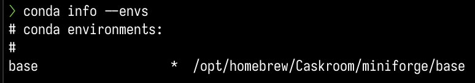
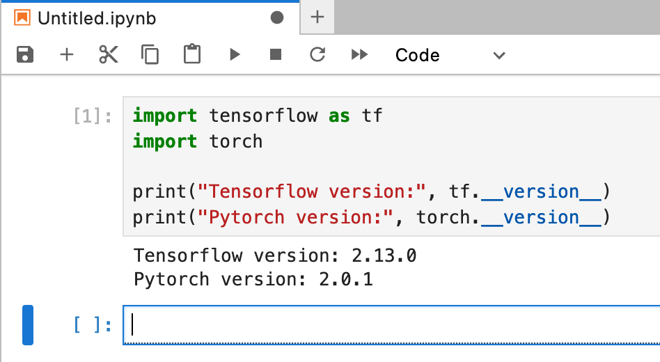
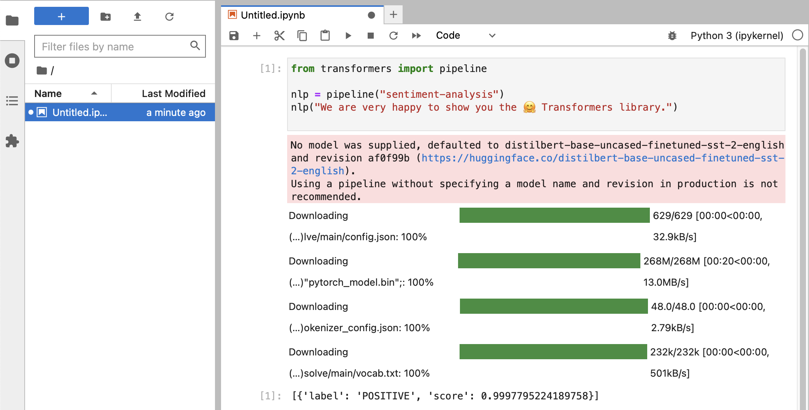

# HuggingFace and Deep Learning guided tour for Macs with Apple Silicon

A guided tour on how to install optimized `tensorflow` and `pytorch` on Apple Silicon Mac and how to use `HuggingFace` large language models for your own experiments.

We will perform the following steps:

- Install `homebrew` and `miniforge` (a minimal version of `anaconda`)
- [Optionally] install tensorflow with metal optimization
- Install pytorch with MPS (metal performance shaders) support
- Install `jupyter lab` to run notebooks
- Install `HuggingFace` and run some pre-trained language models using `transformers` and just a few lines of code within jupyter lab.

## 1. Preparations

### 1.1 Install homebrew

If you haven't done so, go to <https://brew.sh/> and follow the instructions to install homebrew.
Once done, open a terminal and type `brew --version` to check that it is installed correctly.

### 1.2 Install `miniforge` and switch to `conda-forge` channel

In terminal, type `brew install miniforge` to install `miniforge` (a minimal version of `anaconda`).
We will use the package manager `conda` to install the necessary packages both for `tensorflow` and `pytorch`.

Reopen your terminal and check that `conda` is installed correctly by typing `conda --version`.

Modify the default channels used by `conda` by editing the file `~/.condarc` and adding the following lines:

```yaml
channels:
  - pytorch-nightly
  - huggingface
  - conda-forge
  - apple
```

This will allow us to install the latest version of `pytorch` and `tensorflow` and switches to the `conda-forge` channel for all other packages.

#### 1.2.1 Check `conda` installation

Check with `conda config --get channels` that the channels are correctly set.

Update your `conda` installation by typing 

```
conda update conda
conda update --all
```

> **Note:** All installation by `conda` will now install software to the default `base` environment. This also applies to installations with `pip`. You can switch off the `conda` environment by typing `conda deactivate`, and switch back to the `base` environment by typing `conda activate`.

All the following instructions depend on the `conda` envirnment for `base` being active.

To verify your conda environment, type `conda info --envs` and you should see something like:



Now install either `pytorch` or `tensorflow` or both. Note: most projects nowadays use `pytorch`, so if you want to install only one deep learning platform, choose `pytorch`.

### 1.3 Install `tensorflow` [optional]

Following <https://developer.apple.com/metal/tensorflow-plugin/>, we will install `tensorflow` with `conda`.
Note that Apple's instructions also contain x86 instructions, but this guide is only for Apple Silicon.

We will reuse the same `conda` environment for all our software. To install `tensorflow`, type:

```bash
conda install -c apple tensorflow-deps
```

to install the basic dependencies for `tensorflow` from apple's channel. Then we use pip to install `tensorflow-macos` and `tensorflow-metal`:

```bash
pip install tensorflow-macos tensorflow-metal
```

Note: to update `tensorflow` at any later stage, you would:

```bash
conda update -c apple tensorflow-deps
pip install --upgrade tensorflow-macos tensorflow-metal
```

#### 1.3.1 Quick-test

To test that `tensorflow` is installed correctly, open a terminal, type `python` and within the python shell, enter:

```python
import tensorflow as tf
tf.config.list_physical_devices('GPU')
```

You should see something like:
```
[PhysicalDevice(name='/physical_device:GPU:0', device_type='GPU')]
```

### 1.4 Install `pytorch`

Following `https://pytorch.org`, we will install `pytorch-nightly` with `conda`. We use the `nightly` version
in order to get MPS (Metal Performance Shaders) support within pytorch, which offers significant performance advantage.

To install nightly `pytorch` with `conda`, type:

```bash
conda install pytorch torchvision torchaudio -c pytorch-nightly
```

To update at a later stage, type:

```bash
conda update pytorch torchvision torchaudio -c pytorch-nightly
```

#### 1.4.1 Quick-test

To test that `pytorch` is installed correctly, and MPS metal performance shaders are available, open a terminal, type `python` and within the python shell, enter:

```python
import torch
# check if MPS is available:
torch.backends.mps.is_available()
```

This should return `True`.

### 1.5 Jupyter lab

At this point, your Apple Silicon Mac should be ready to run `tensorflow` and `pytorch` with hardware acceleration support, using the Apple Metal framework.

To test this, you can use `jupyter lab` to run some notebooks. To install `jupyter lab`, type:

```bash
conda install jupyterlab
```

To start `jupyter lab`, type:

```bash
jupyter lab
```

This should open a browser window with `jupyter lab` running. You can then create a new python notebook and run some code to test that `tensorflow` and `pytorch` are working correctly:



```python
import tensorflow as tf
import torch

print("Tensorflow version:", tf.__version__)
print("Pytorch version:", torch.__version__)
```

If this completed successful, your Mac is now ready for Deep Learning experiments.

## 1.6 HuggingFace

HuggingFace is a great resource for NLP and Deep Learning experiments. It provides a large number of pre-trained language models and a simple API to use them. It will allow us to quickly get started with Deep Learning experiments.

### 1.6.1 Install `transformers`


From the [huggingface installation instructions](https://huggingface.co/docs/transformers/installation), we use `conda` to install `transformers`, using the `huggingface` channel we have set up before. Type:

```bash
conda install transformers
```

> **Note:** When experimenting with HuggingFace, you will download large models that will be stored in your home directory at: `~/.cache/huggingface/hub`. 
> You can remove these models at any time by deleting this directory or parts of it's content.

> **Note:** Some of the models will require additional models to be installed. As a rule of thumb, if you get an error about a missing module `missing_module`, try first to install with `conda install missing_module` and if that fails, try `pip install missing_module`.


## 2.0 Experiments

From terminal, create a directly for your experiments, e.g. 

```bash
mkdir ~/lab
cd ~/lab
```

Now start `jupyter lab` and create a new 'Python 3' notebook. You can then run the following code to test that `transformers` is working correctly:

### 2.1 System check with basic sentiment analysis

```python
from transformers import pipeline

nlp = pipeline("sentiment-analysis")
nlp("We are very happy to show you the 🤗 Transformers library.")
```

Your should see something like this:



If you've received a label classification of `POSITIVE` with a score of `0.99`, then you are ready to start experimenting with HuggingFace!

> **Note:** You'll see that the `HuggingFace` libraries are downloading all sorts of large binary blobs containing the trained model data. That data is stored in your home directory at: `~/.cache/huggingface/hub`. You can remove these models at any time by deleting this directory or parts of it's content.

### 2.2 Minimal chat-bot

```python
from transformers import AutoModelForCausalLM, AutoTokenizer

tokenizer = AutoTokenizer.from_pretrained("microsoft/DialoGPT-small")
model = AutoModelForCausalLM.from_pretrained("microsoft/DialoGPT-small")

# Let's chat for 5 lines
for step in range(5):
    # encode the new user input, add the eos_token and return a tensor in Pytorch
    new_user_input_ids = tokenizer.encode(input(">> User:") + tokenizer.eos_token, return_tensors='pt')

    # append the new user input tokens to the chat history
    bot_input_ids = torch.cat([chat_history_ids, new_user_input_ids], dim=-1) if step > 0 else new_user_input_ids

    # generated a response while limiting the total chat history to 1000 tokens, 
    chat_history_ids = model.generate(bot_input_ids, max_length=1000, pad_token_id=tokenizer.eos_token_id)

    # pretty print last ouput tokens from bot
    print("DialoGPT: {}".format(tokenizer.decode(chat_history_ids[:, bot_input_ids.shape[-1]:][0], skip_special_tokens=True)))
```
